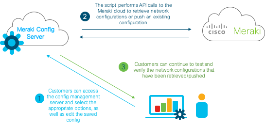
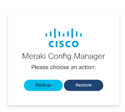
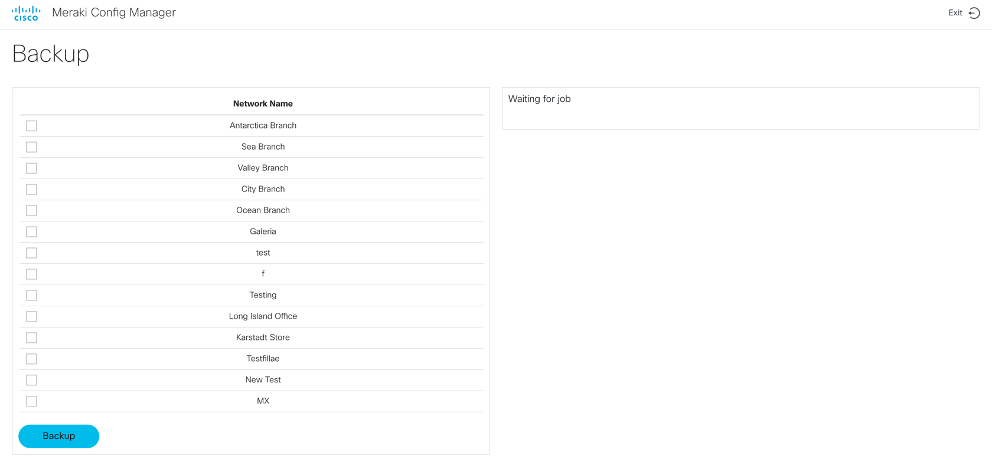
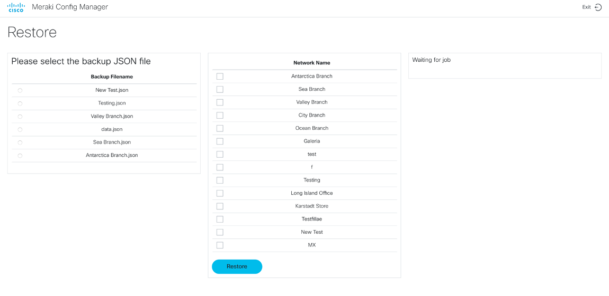

# Meraki Config Manager
This is the Meraki Config Manager source code. Using the Meraki Dashboard API and Flask, we have developed an application
that can provide a simple way to backup and restore Meraki settings into a file. This file can then be edited by network teams 
to suit the needs of the Meraki network.



## Contacts

* Josh Ingeniero (jingenie@cisco.com)
* Monica Acosta (moacosta@cisco.com)

## Solution Components
* Python
* Flask
* Meraki Dashboard API
* Meraki MR Access Points
* Meraki MX Gateways
* Meraki MS Switches

## Installation:

#### Clone the repo
```
$ git clone https://wwwin-github.cisco.com/gve/meraki-topdesk.git
```

#### Install dependencies
```
$ pip install -r requirements.txt
```

## Setup:
#### Meraki details :
You can deploy this prototype in a lab environment or on your own Meraki dashboard online
[here](https://account.meraki.com/secure/login/dashboard_login).
Fill in the details of your Meraki deployment in the [DETAILS.py](DETAILS.py) file
```python

MERAKI_API_KEY = 'YOUR MERAKI API KEY'
MERAKI_ORGANIZATION_ID = 'YOUR MERAKI ORG ID'

```

## Usage:
Launch the config script. Make sure that you have your venv activated.
```commandline
$ flask run --port=5000
```

#### Running
Launch your web browser and navigate to [localhost:5000](localhost:5000) or with your configured port.

You will be asked whether to backup or restore configs



#### Backup
The Backup Page will allow you to select the networks you would like to backup. These will then be saved as .json files in the [configs](configs) folder of the app



#### Backup structure
After back up, data will be stored in [data.json](configs/data.json) in the configs folder with the following JSON format
```json
{
    "mx_l7_firewall": {
        "rules": [
            {
                "policy": "deny",
                "type": "host",
                "value": "yahoo.com"
            },
            {
                "policy": "deny",
                "type": "application",
                "value": {
                    "id": "meraki:layer7/application/189",
                    "name": "Blizzard"
                }
            },
            {
                "policy": "deny",
                "type": "applicationCategory",
                "value": {
                    "id": "meraki:layer7/category/9",
                    "name": "Social web & photo sharing"
                }
            }
        ]
    },
    "mx_1_1_nat_rules": {
        "rules": [
            {
                "name": "Testing",
                "publicIp": "101.3.1.5",
                "lanIp": "192.168.128.3",
                "uplink": "internet1",
                "allowedInbound": []
            },
            {
                "name": "testing2",
                "publicIp": "101.3.1.6",
                "lanIp": "192.168.128.5",
                "uplink": "internet1",
                "allowedInbound": []
            }
        ]
    },
    "wireless_settings": {
        "meshingEnabled": true,
        "ipv6BridgeEnabled": true,
        "locationAnalyticsEnabled": true,
        "ledLightsOn": true
    },
    "ssids": [
        {
            "number": 0,
            "name": "Testing - wireless WiFi",
            "enabled": true,
            "splashPage": "None",
            "ssidAdminAccessible": false,
            "authMode": "open",
            "ipAssignmentMode": "NAT mode",
            "minBitrate": 11,
            "bandSelection": "Dual band operation",
            "perClientBandwidthLimitUp": 0,
            "perClientBandwidthLimitDown": 0,
            "visible": true,
            "availableOnAllAps": true,
            "availabilityTags": []
        },
        {
            "number": 1,
            "name": "Testing 2 SSID 2",
            "enabled": true,
            "splashPage": "None",
            "ssidAdminAccessible": false,
            "authMode": "open",
            "ipAssignmentMode": "NAT mode",
            "minBitrate": 11,
            "bandSelection": "Dual band operation",
            "perClientBandwidthLimitUp": 0,
            "perClientBandwidthLimitDown": 0,
            "visible": true,
            "availableOnAllAps": true,
            "availabilityTags": []
        },
        {
            "number": 2,
            "name": "testing 3 SSID 3",
            "enabled": false,
            "splashPage": "None",
            "ssidAdminAccessible": false,
            "authMode": "open",
            "ipAssignmentMode": "NAT mode",
            "minBitrate": 11,
            "bandSelection": "Dual band operation",
            "perClientBandwidthLimitUp": 0,
            "perClientBandwidthLimitDown": 0,
            "visible": true,
            "availableOnAllAps": true,
            "availabilityTags": []
        },
        {
            "number": 3,
            "name": "new testing SSID 4",
            "enabled": false,
            "splashPage": "None",
            "ssidAdminAccessible": false,
            "authMode": "open",
            "ipAssignmentMode": "NAT mode",
            "minBitrate": 11,
            "bandSelection": "Dual band operation",
            "perClientBandwidthLimitUp": 0,
            "perClientBandwidthLimitDown": 0,
            "visible": true,
            "availableOnAllAps": true,
            "availabilityTags": []
        },
        {
            "number": 4,
            "name": "Unconfigured SSID 5",
            "enabled": false,
            "splashPage": "None",
            "ssidAdminAccessible": false,
            "authMode": "open",
            "ipAssignmentMode": "NAT mode",
            "minBitrate": 11,
            "bandSelection": "Dual band operation",
            "perClientBandwidthLimitUp": 0,
            "perClientBandwidthLimitDown": 0,
            "visible": true,
            "availableOnAllAps": true,
            "availabilityTags": []
        },
        {
            "number": 5,
            "name": "Unconfigured SSID 6",
            "enabled": false,
            "splashPage": "None",
            "ssidAdminAccessible": false,
            "authMode": "open",
            "ipAssignmentMode": "NAT mode",
            "minBitrate": 11,
            "bandSelection": "Dual band operation",
            "perClientBandwidthLimitUp": 0,
            "perClientBandwidthLimitDown": 0,
            "visible": true,
            "availableOnAllAps": true,
            "availabilityTags": []
        },
        {
            "number": 6,
            "name": "Unconfigured SSID 7",
            "enabled": false,
            "splashPage": "None",
            "ssidAdminAccessible": false,
            "authMode": "open",
            "ipAssignmentMode": "NAT mode",
            "minBitrate": 11,
            "bandSelection": "Dual band operation",
            "perClientBandwidthLimitUp": 0,
            "perClientBandwidthLimitDown": 0,
            "visible": true,
            "availableOnAllAps": true,
            "availabilityTags": []
        },
        {
            "number": 7,
            "name": "Unconfigured SSID 8",
            "enabled": false,
            "splashPage": "None",
            "ssidAdminAccessible": false,
            "authMode": "open",
            "ipAssignmentMode": "NAT mode",
            "minBitrate": 11,
            "bandSelection": "Dual band operation",
            "perClientBandwidthLimitUp": 0,
            "perClientBandwidthLimitDown": 0,
            "visible": true,
            "availableOnAllAps": true,
            "availabilityTags": []
        },
        {
            "number": 8,
            "name": "Unconfigured SSID 9",
            "enabled": false,
            "splashPage": "None",
            "ssidAdminAccessible": false,
            "authMode": "open",
            "ipAssignmentMode": "NAT mode",
            "minBitrate": 11,
            "bandSelection": "Dual band operation",
            "perClientBandwidthLimitUp": 0,
            "perClientBandwidthLimitDown": 0,
            "visible": true,
            "availableOnAllAps": true,
            "availabilityTags": []
        },
        {
            "number": 9,
            "name": "Unconfigured SSID 10",
            "enabled": false,
            "splashPage": "None",
            "ssidAdminAccessible": false,
            "authMode": "open",
            "ipAssignmentMode": "NAT mode",
            "minBitrate": 11,
            "bandSelection": "Dual band operation",
            "perClientBandwidthLimitUp": 0,
            "perClientBandwidthLimitDown": 0,
            "visible": true,
            "availableOnAllAps": true,
            "availabilityTags": []
        },
        {
            "number": 10,
            "name": "Unconfigured SSID 11",
            "enabled": false,
            "splashPage": "None",
            "ssidAdminAccessible": false,
            "authMode": "open",
            "ipAssignmentMode": "NAT mode",
            "minBitrate": 11,
            "bandSelection": "Dual band operation",
            "perClientBandwidthLimitUp": 0,
            "perClientBandwidthLimitDown": 0,
            "visible": true,
            "availableOnAllAps": true,
            "availabilityTags": []
        },
        {
            "number": 11,
            "name": "Unconfigured SSID 12",
            "enabled": false,
            "splashPage": "None",
            "ssidAdminAccessible": false,
            "authMode": "open",
            "ipAssignmentMode": "NAT mode",
            "minBitrate": 11,
            "bandSelection": "Dual band operation",
            "perClientBandwidthLimitUp": 0,
            "perClientBandwidthLimitDown": 0,
            "visible": true,
            "availableOnAllAps": true,
            "availabilityTags": []
        },
        {
            "number": 12,
            "name": "Unconfigured SSID 13",
            "enabled": false,
            "splashPage": "None",
            "ssidAdminAccessible": false,
            "authMode": "open",
            "ipAssignmentMode": "NAT mode",
            "minBitrate": 11,
            "bandSelection": "Dual band operation",
            "perClientBandwidthLimitUp": 0,
            "perClientBandwidthLimitDown": 0,
            "visible": true,
            "availableOnAllAps": true,
            "availabilityTags": []
        },
        {
            "number": 13,
            "name": "Unconfigured SSID 14",
            "enabled": false,
            "splashPage": "None",
            "ssidAdminAccessible": false,
            "authMode": "open",
            "ipAssignmentMode": "NAT mode",
            "minBitrate": 11,
            "bandSelection": "Dual band operation",
            "perClientBandwidthLimitUp": 0,
            "perClientBandwidthLimitDown": 0,
            "visible": true,
            "availableOnAllAps": true,
            "availabilityTags": []
        },
        {
            "number": 14,
            "name": "Unconfigured SSID 15",
            "enabled": false,
            "splashPage": "None",
            "ssidAdminAccessible": false,
            "authMode": "open",
            "ipAssignmentMode": "NAT mode",
            "minBitrate": 11,
            "bandSelection": "Dual band operation",
            "perClientBandwidthLimitUp": 0,
            "perClientBandwidthLimitDown": 0,
            "visible": true,
            "availableOnAllAps": true,
            "availabilityTags": []
        }
    ],
    "switch_port_schedules": [
        {
            "id": "698057942242427297",
            "networkId": "L_698057942242442827",
            "name": "Testing",
            "portSchedule": {
                "monday": {
                    "active": true,
                    "from": "00:00",
                    "to": "24:00"
                },
                "tuesday": {
                    "active": true,
                    "from": "00:00",
                    "to": "24:00"
                },
                "wednesday": {
                    "active": true,
                    "from": "00:00",
                    "to": "24:00"
                },
                "thursday": {
                    "active": true,
                    "from": "00:00",
                    "to": "24:00"
                },
                "friday": {
                    "active": true,
                    "from": "00:00",
                    "to": "24:00"
                },
                "saturday": {
                    "active": true,
                    "from": "00:00",
                    "to": "24:00"
                },
                "sunday": {
                    "active": true,
                    "from": "00:00",
                    "to": "24:00"
                }
            }
        }
    ],
    "switch_acls": [
        {
            "comment": "test",
            "policy": "deny",
            "ipVersion": "ipv4",
            "protocol": "tcp",
            "srcCidr": "10.0.0.1/32",
            "srcPort": "any",
            "dstCidr": "any",
            "dstPort": "any",
            "vlan": "any"
        }
    ]
}
```

#### Restore
The Restore Page will allow you to choose from existing backup .json files the [configs](configs) folder, and select which networks it should restore




#### Adding new configs
Currently, the code supports backing up and restoring the following configurations:
* MX L7 Firewall Rules
* MX 1-to-1 NAT Rules
* Wireless Settings
* Switch ACLs
* Switch Port Schedules
* AMP Settings - _if applicable_

In [backup.py](./backup.py), you are able to modify the backup and restore functions to add additional
configurations that you may want to use. You may visit the [Meraki Dashboard API Docs](https://developer.cisco.com/meraki/api/)
for more information.

## License
Provided under Cisco Sample Code License, for details see [LICENSE](./LICENSE.txt)

## Code of Conduct
Our code of conduct is available [here](./CODE_OF_CONDUCT.md)

## Contributing
See our contributing guidelines [here](./CONTRIBUTING.md)